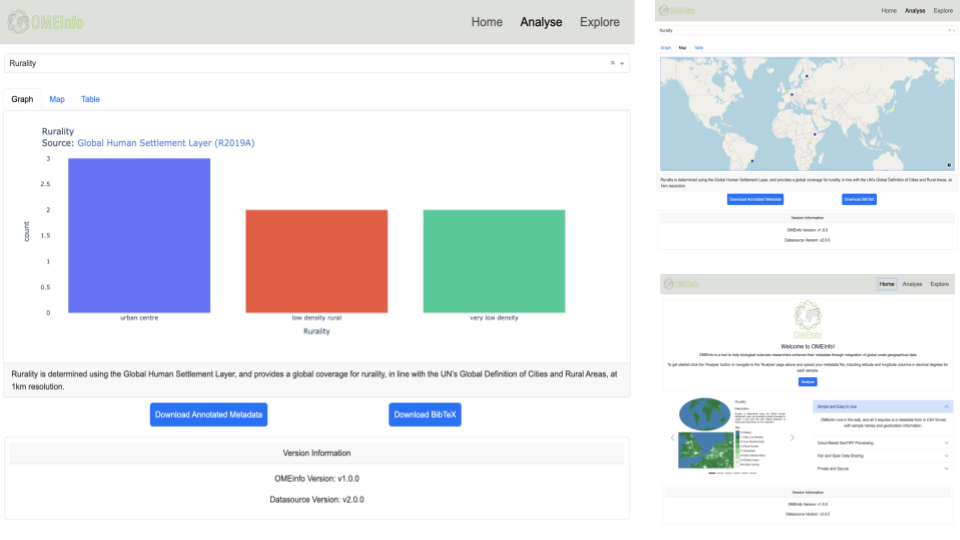
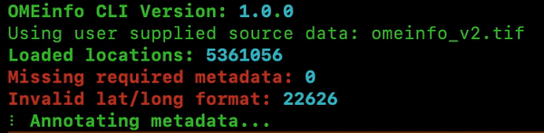

[](https://doi.org/10.1093/bioadv/vbae025)

[](https://zenodo.org/badge/latestdoi/390303490)

<p align="center">
  
</p>

OMEinfo is an open-source bioinformatics tool designed to automate the retrieval of consistent geographical metadata for microbiome research. It provides an easy-to-use interface for researchers to obtain geographical metadata, including Köppen-Geiger climate classification, degree of rurality, population density, and fossil fuel CO<sub>2</sub> emissions from user-provided location data. The tool aims to facilitate cross-study comparisons and promote reproducibility in microbiome research by adhering to the principles of FAIR and Open data.

Publication available now at Bioinformatics Advances: [OMEinfo: Global Geographic Metadata for -omics Experiments](https://doi.org/10.1093/bioadv/vbae025)

See [here](#dash-app-walkthrough-with-test-data) for a walkthrough of using OMEinfo with test data.

## Features

- Dash web application for user-friendly data upload and visualization
- Custom Cloud Optimized GeoTIF file hosted on Figshare for efficient data access
- Integration with open data sources, such as Global Human Settlement Layer (GHSL)
- Portable and lightweight Docker container for easy deployment
- Adheres to FAIR and Open data principles for better reproducibility and collaboration

## Table of Contents

- [Features](#features)
- [Installation](#installation)
  - [Pre-built docker image](#pre-built-docker-image)
  - [Build image from Source](#build-image-from-source)
  - [Command Line Tool](#command-line-tool)
- [Usage](#usage)
  - [Dash App Walkthrough](#dash-app-walkthrough-with-test-data)
  - [Command Line Tool Walkthrough](#command-line-tool-walkthrough-with-test-data)
- [Data Sources](#data-sources)
  - [Current: OMEinfo V2 dataset](#current-omeinfo-v2-dataset)
  - [Past: OMEinfo V1 dataset](#past-omeinfo-v1-dataset)
- [License](#license)
- [Support](#support)

## Installation

OMEinfo is provided as a Docker container and command line tool, which can be easily set up in a local environment or on cloud-based platforms. OMEinfo has been tested to work using Rocky Linux 8.8, Windows 10 22H2 (via WSL) and MacOS 13.2.

### Pre-built docker image

1. Install Docker on your machine following the [official installation guide](https://docs.docker.com/get-docker/). NOTE: If running on Windows, Docker will also require Windows Subsystem for Linux to be installed - see the documentation [here](https://learn.microsoft.com/en-us/windows/wsl/install). You may also need to disable or allow WSL access to the internet in your firewall.
2. Pull the Docker image from Docker-Hub: `docker pull mattcrown/omeinfo:latest` or `docker pull mattcrown/omeinfo:1.1.0`
3. Run the Docker container: `docker run -p 8050:8050 mattcrown/omeinfo:latest` or `docker run -p 8050:8050 mattcrown/omeinfo:1.1.0` (see [Usage](#usage) for for more parameters when running the docker container).

### Build image from Source

1. Install Docker on your machine following the [official installation guide](https://docs.docker.com/get-docker/). NOTE: If running on Windows, Docker will also require Windows Subsystem for Linux to be installed - see the documentation [here](https://learn.microsoft.com/en-us/windows/wsl/install). You may also need to disable or allow WSL access to the internet in your firewall.
2. Clone this repository: `git clone https://github.com/m-crown/OMEinfo.git`
3. Navigate to the project app directory: `cd OMEinfo/OMEinfo`
4. Build the Docker image: `docker build -t omeinfo .` Note: you may need to prefix this command with sudo.
5. Run the Docker container: `docker run -p 8050:8050 omeinfo` (see [Usage](#usage) for more details)

### Command Line Tool

1. Install [mamba](https://mamba.readthedocs.io/en/latest/mamba-installation.html).
2. Clone this repository: `git clone https://github.com/m-crown/OMEinfo.git`
3. `cd OMEinfo/OMEinfo`
4. Create a mamba environment using the .yml file: `conda_cli_requirements.yml`: `mamba env create --file conda_cli_requirements.yml`
   *Note* The file `conda_requirements.yml` is used in the Docker container and writes the base environment. It is not recommended to use this file for CLI usage.
5. Activate the conda environment: `mamba activate omeinfo`
6. Copy OMEinfo to the environment bin: `cp omeinfo.py $CONDA_PREFIX/bin/`
7. Copy Rurality and Koppen-Geiger legends to bin: `cp *.txt $CONDA_PREFIX/bin/`

(see [Usage](#usage) for more details)

## Usage

### Dash app walkthrough with test data 

1. Run the Docker container:
   * For default mode: `docker run -p 8050:8050 omeinfo` or `docker run -p 8050:8050 mattcrown/omeinfo:latest` if you pulled the image from Docker Hub.
   * To specify a specific OMEinfo data version: `docker run -p 8050:8050 -e OMEINFO_VERSION data_version omeinfo` where data version may be 1.0.0 or 2.0.0
2. Open the OMEinfo web application in your browser at `http://localhost:8050`.
3. Upload a CSV or TSV file containing geolocation data (latitude and longitude) using the provided interface. A test addresses file is distributed with the OMEinfo GitHub repo, `OMEinfo/test_data/test_addresses.tsv`, which provides example locations covering a variety of possible annotations. Download this file or clone the repo to use it within the Docker app (or CLI). NOTE: if downloading the file, use [this](https://raw.githubusercontent.com/m-crown/OMEinfo/main/test_data/test_addresses.tsv) link for the raw file, and be aware that some browsers may add a `.txt` suffix to the file. Be sure to upload CSV or TSV files with a `.csv` or `.tsv` extension for compatibility. 
4. The application will retrieve the geographical metadata for the uploaded locations and display the results on a map and in a histogram.
5. You can choose to display metadata features as the colour coding on the map and as the histogram's x-axis.
6. A table with the processed data is also provided for further analysis.
7. When finished using OMEinfo app, stop the Docker container using `docker stop <container_id_or_name>` where `<container_id_or_name>` is the path of your container instance e.g. `omeinfo` if built locally or `mattcrown/omeinfo:latest` if running an image from Docker Hub. You can list running containers in Docker using `docker ps`.



### Command Line Tool walkthrough with test data

Running the command line tool requires only a single command. Assuming you want to analyse the test addresses file from the GitHub repo, and are currently in the directory containing this file, run the following command:

`omeinfo.py --location_file test_addresses.tsv`

Upon running the command, a summary of the samples to be processed, and the versions of CLI tool and data packet being used will be presented. Upon completion, a table of the first 10 samples analysed will be shown, and a file with annotated metadata will be saved to the current directory, together with a BibTeX citation file of all citations necessary for crediting data authors.

The full command line parameters are presented below:

```
usage: omeinfo.py [-h] [--location_file LOCATION_FILE] [--location LOCATION] [--data_version DATA_VERSION] [--source_data SOURCE_DATA] [--output_file OUTPUT_FILE] [--n_samples N_SAMPLES] [--quiet QUIET]

The OMEinfo command-line tool enables users to annotate geographical metadata, including Koppen climate classification, degree of rurality, population density, and fossil fuel CO2 emissions, from user-provided location data. The tool
offers options for selecting the data version and the data source. Annotations are stored in a specified output file in TSV format.

options:
  -h, --help            show this help message and exit
  --location_file LOCATION_FILE
                        file containing locations
  --location LOCATION   location in latitude,longitude EPSG:4326 format, input string in format 'sample,latitude,longitude'
  --data_version DATA_VERSION
                        version of data to use
  --source_data SOURCE_DATA
                        url to data or filepath to local version
  --output_file OUTPUT_FILE
                        name of output file
  --n_samples N_SAMPLES
                        number of output summary table samples to show in command line
  --quiet QUIET         suppress console output
```
<p align="center">
  
</p>

<p align="center">
  
</p>

### Running OMEinfo with locally stored geoTIFF files

By default, OMEinfo runs analyses with a version of the data packet stored in the cloud (currently, via Figshare). It is also possible to run OMEinfo using a locally stored version of the data packet, should the remote version become unavailable.

For the Dash app, build as normal, or download from Docker hub, and change directory to the location where the local version of the data packet is stored. On execution add the following parameters:

`docker run -p 8050:8050 mattcrown/omeinfo:latest -v $PWD:/data/ -e OMEINFO_URL=/data/[DATA_PACKET_HERE] omeinfo`

$PWD can also be replaced with the fully resolved path to the directory in which the data packet is stored on your machine. Replace [DATA_PACKET_HERE] with the filename(s) of the data packet files necessary for analysis. For example, if running the OMEinfo v2 data packet locally (a single file) the command would look like this:

`docker run -p 8050:8050 -v $PWD:/data/ -e OMEINFO_URL=/data/omeinfo_v2.tif -e OMEINFO_VERSION=2.0.0 mattcrown/omeinfo:latest`

and from the CLI tool:

`omeinfo.py --data_version 2.0.0 --source_data omeinfo_v2.tif --location_file test_addresses.tsv`

If running the OMEinfo v1 data packet, it would instead look like this:

`docker run -p 8050:8050 -v $PWD:/data/ -e OMEINFO_URL=/data/rurpopkop_v1_cog.tif,/data/co2_v1_cog.tif,/data/no2_v1_cog.tif -e OMEINFO_VERSION=1.0.0 mattcrown/omeinfo:latest`

and from the CLI tool (assuming you are currently in the directory with the data files and test data file):

`omeinfo.py --data_version 1.0.0 --source_data rurpopkop_v1_cog.tif,co2_v1_cog.tif,no2_v1_cog.tif --location_file test_addresses.tsv`

With the v1 data packet, it is important to specify files as a single comma-separated string, in the order RurPopKop file, CO2 file, NO2 file.

## Data Sources

### Current: OMEinfo V2 dataset

| File Name      | File URL                                                 | Description                                                                                                           |
| -------------- | -------------------------------------------------------- | --------------------------------------------------------------------------------------------------------------------- |
| omeinfo_v2.tif | [Figshare](https://doi.org/10.6084/m9.figshare.25000343.v1) | All data sources unified in a single WGS84 COG. Additionally includes relative deprivation on top of V1 data sources. |

### Past: OMEinfo V1 dataset

| File Name            | File URL                                                             | Description                                                            |
| -------------------- | -------------------------------------------------------------------- | ---------------------------------------------------------------------- |
| co2_v1_cog.tif       | [Figshare](https://doi.org/10.6084/m9.figshare.25000025.v1)| Fossil Fuel CO2 Emissions |
| rurpopkop_v1_cog.tif | [Figshare](https://doi.org/10.6084/m9.figshare.25000025.v1) | Rurality, Population Density, and Koppen-Geiger Climate Classification |
| no2_v1_cog.tif       | [Figshare](https://doi.org/10.6084/m9.figshare.25000025.v1) | Tropospheric NO2 Emissions |

For details on the process for the creation of the current data sources, see the explanation [here](https://github.com/m-crown/OMEinfo/blob/main/data_processing.md)

### Spatial Extents

| Data Type                             | Spatial Extents                                                                                                                      |
| ------------------------------------- | ------------------------------------------------------------------------------------------------------------------------------------ |
| Rurality                              | Upper Left: -179.999, 89.091<br>Lower Left: -179.999, -89.094</br>Upper Right: 179.997, 89.091<br>Lower Right: 179.997, -89.094</br> |
| Population Density                    | Upper Left: -179.999, 89.091<br>Lower Left: -179.999, -89.094</br>Upper Right: 179.997, 89.091<br>Lower Right: 179.997, -89.094</br> |
| Koppen Geiger Climate Classification  | Upper Left: -180.00, 90.00<br>Lower Left: -180.00, -90.00</br>Upper Right: 180.00, 90.00<br>Lower Right: 180.00, -90.00</br>         |
| Fossil Fuel CO<sub>2</sub> Emissions  | Upper Left: -180.00, 90.00<br>Lower Left: -180.00, -90.00</br>Upper Right: 180.00, 90.00<br>Lower Right: 180.00, -90.00</br>         |
| Tropospheric NO<sub>2</sub> Emissions | Upper Left: -180.00, 90.00<br>Lower Left: -180.00, -90.00</br>Upper Right: 180.00, 90.00<br>Lower Right: 180.00, -90.00</br>         |
| Relative Deprivation                  | Upper Left: -180.00, 82.183<br>Lower Left: -180.00, -55.983</br>Upper Right: 179.816, 82.183<br>Lower Right: 179.816, -55.983</br>   |
| OMEinfo v2 Data Packet Combined       | Upper Left: -180.00, 90.00<br>Lower Left: -180.00, -89.998</br>Upper Right: 179.996, 90.00<br>Lower Right: 179.996, -89.998</br>     |

### Citations

| Data Source                                | Citation                                                                                                                                                                                                                                                                                                             | DOI                                                                                                                |
| ------------------------------------------ | -------------------------------------------------------------------------------------------------------------------------------------------------------------------------------------------------------------------------------------------------------------------------------------------------------------------- | ------------------------------------------------------------------------------------------------------------------ |
| Fossil Fuel CO<sub>2</sub> emissions data  | Tomohiro Oda, Shamil Maksyutov (2015), ODIAC Fossil Fuel CO<sub>2</sub> Emissions Dataset (Version name: ODIAC2020b), Center for Global Environmental Research, National Institute for Environmental Studies                                                                                                         | [10.17595/20170411.001](https://doi.org/10.17595/20170411.001)                                                     |
| Köppen-Geiger Climate Classification       | Beck, H., Zimmermann, N., McVicar, T. et al. Present and future Köppen-Geiger climate classification maps at 1-km resolution. Sci Data 5, 180214 (2018)                                                                                                                                                              | [10.1038/sdata.2018.214](https://doi.org/10.1038/sdata.2018.214)                                                   |
| Population Density                         | Schiavina, Marcello; Freire, Sergio; MacManus, Kytt (2019): GHS population grid multitemporal (1975, 1990, 2000, 2015) R2019A. European Commission, Joint Research Centre (JRC)                                                                                                                                      | [European Commission](https://doi.org/10.2905/42E8BE89-54FF-464E-BE7B-BF9E64DA5218)                                |
| Rurality                                   | Pesaresi, Martino; Florczyk, Aneta; Schiavina, Marcello; Melchiorri, Michele; Maffenini, Luca (2019): GHS settlement grid, updated and refined REGIO model 2014 in application to GHS-BUILT R2018A and GHS-POP R2019A, multitemporal (1975-1990-2000-2015), R2019A. European Commission, Joint Research Centre (JRC) | [European Commission](https://doi.org/10.2905/42E8BE89-54FF-464E-BE7B-BF9E64DA5218)                                |
| Tropospheric NO<sub>2</sub> Emissions data | Romahn, Pedergnana, Loyola, Apituley, Sneep and Veefkind (2022): Sentinel-5 Precursor/TROPOMI Level 2 Product User Manual: Cloud Properties                                                                                                                                                                          | [ESA Sentinel 5P](https://sentinel.esa.int/documents/247904/2474726/Sentinel-5P-Level-2-Product-User-Manual-Cloud) |
| Relative Deprivation Index                 | NASA Socioeconomic Data and Applications Center (SEDAC) (2022)                                                                                                                                                                                                                                                       | [SEDAC](https://sedac.ciesin.columbia.edu/data/set/povmap-grdi-v1)                                                 |

Download the [current citations in BibTeX format](citations/v2_citations.bib).

Past citations can be found in BibTeX format in the [citations](citations/) directory of OMEinfo.

## License

OMEinfo is released under the [MIT License](https://opensource.org/licenses/MIT). By using OMEinfo, you agree to the terms and conditions of this license. See the `LICENSE` file in this repo for more information.

## Support

If you encounter any issues or have questions about using OMEinfo, please create an issue on this repo.
